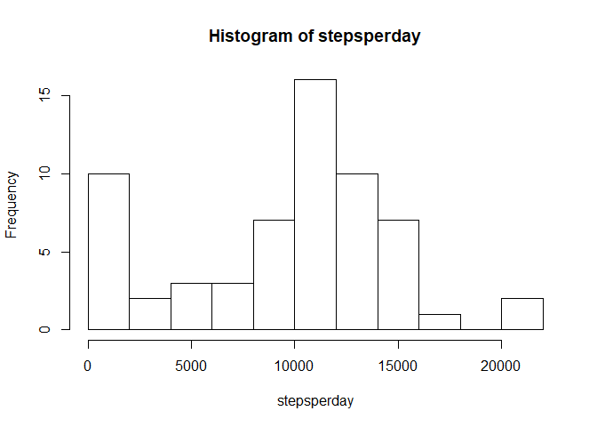

## Loading and preprocessing the data

Downloading and unzipping data. Setting cache = TRUE because this shouldn't have
to be done more than once.


```r
download.file("https://d396qusza40orc.cloudfront.net/repdata%2Fdata%2Factivity.zip", "activitymonitordata.zip")
unzip("activitymonitordata.zip")
```

Now that the files have been downloaded, I can load them. Let's take a quick
look at the unzipped csv file.


```r
activity <- read.csv("activity.csv")
head(activity, 10)
```

```
##    steps       date interval
## 1     NA 2012-10-01        0
## 2     NA 2012-10-01        5
## 3     NA 2012-10-01       10
## 4     NA 2012-10-01       15
## 5     NA 2012-10-01       20
## 6     NA 2012-10-01       25
## 7     NA 2012-10-01       30
## 8     NA 2012-10-01       35
## 9     NA 2012-10-01       40
## 10    NA 2012-10-01       45
```
Looks fairly tidy, so we can move on.

## What is mean total number of steps taken per day?

First, the histogram:


```r
complete <- complete.cases(activity)
completeactivity <- activity[complete,]

stepsperday <- sapply(split(completeactivity$steps, completeactivity$date), 
                      sum)
hist(stepsperday, breaks = 10)
```

<!-- -->

So it looks like the most steps per day is between 10000 and 12000.


```r
MeanSteps <- mean(stepsperday)
MedianSteps <- median(stepsperday)

print (paste("Mean steps = ", round(MeanSteps,1)))
```

```
## [1] "Mean steps =  9354.2"
```

```r
print (paste("Median steps = ", MedianSteps)) 
```

```
## [1] "Median steps =  10395"
```


## What is the average daily activity pattern?


```r
library(dplyr)
```

```
## 
## Attaching package: 'dplyr'
```

```
## The following objects are masked from 'package:stats':
## 
##     filter, lag
```

```
## The following objects are masked from 'package:base':
## 
##     intersect, setdiff, setequal, union
```

```r
splitactivity <- group_by(completeactivity, interval)
steps <- summarize(splitactivity, meanstepsperday= mean(steps))

plot(steps$interval, steps$meanstepsperday,type = "l", lwd = 2, 
     xlab = "Interval", ylab = "Steps", 
     main = "Average steps in 5-minute intervals")
```

<!-- -->


```r
maximum <- max(steps$meanstepsperday)
index <- grep(maximum, steps$meanstepsperday)
print(paste("The interval with the most steps on average is interval",
            steps[index,"interval"]))
```

```
## [1] "The interval with the most steps on average is interval 835"
```


## Imputing missing values


```r
## Number of rows with NAs 
Incomplete <- sum(!complete)

print( paste("The number of incomplete cases (missing values) is",Incomplete))
```

```
## [1] "The number of incomplete cases (missing values) is 2304"
```

Strategy for imputing values is to use the mean for the 5-minute interval.


```r
activity2<-activity
n <- nrow(activity2)


for(i in 1:n){
        if(!is.na(activity2$steps[i])){ 
                
        }
        else {
                interval1 <- activity2$interval[i]
                findit <- steps[,"interval"]==interval1
                steps1 <- steps$meanstepsperday[findit]
                activity2$steps[i] <- steps1
               
        }
}
stepsperday2 <- sapply(split(activity2$steps, activity2$date), 
                       sum)
hist(stepsperday2, breaks = 10)
```

<!-- -->

```r
newcompletecases<- complete.cases(activity2)
sum(!newcompletecases)
```

```
## [1] 0
```


```r
MeanSteps2 <- mean(stepsperday2)
MedianSteps2 <- round(median(stepsperday2),1)


print (paste("Mean steps = ", round(MeanSteps2,1)))
```

```
## [1] "Mean steps =  10766.2"
```

```r
print (paste("Median steps = ", MedianSteps2))  
```

```
## [1] "Median steps =  10766.2"
```

The mean and median have both increased, although probably not enough to be
statistically significant. Also, they are now the same value.


## Are there differences in activity patterns between weekdays and weekends?


```r
library(ggplot2)

activity2$dow <- weekdays(as.Date(activity2$date, format = "%Y-%m-%d"))
activity2$days <- "Weekday"

n <- nrow(activity2)

for(i in 1:n){
        
        if(activity2[i, "dow"] == "Sunday" | activity2[i, "dow"] == "Saturday"){
                activity2[i, "days"] <- "Weekend"
        }
}

activity2$days <- as.factor(activity2$days)

stepsperdow <- group_by(activity2, interval, days)
act2reduced <- summarize(stepsperdow, Mean = mean(steps))
act2reduced
```

```
## # A tibble: 576 x 3
## # Groups:   interval [288]
##    interval days       Mean
##       <int> <fct>     <dbl>
##  1        0 Weekday 2.25   
##  2        0 Weekend 0.215  
##  3        5 Weekday 0.445  
##  4        5 Weekend 0.0425 
##  5       10 Weekday 0.173  
##  6       10 Weekend 0.0165 
##  7       15 Weekday 0.198  
##  8       15 Weekend 0.0189 
##  9       20 Weekday 0.0990 
## 10       20 Weekend 0.00943
## # ... with 566 more rows
```

```r
ggplot(act2reduced, aes(x = interval, y = Mean, col = days)) + geom_point() + 
        geom_line() + facet_grid(rows = vars(act2reduced$days))
```

<!-- -->

Not surprisingly to me, the main takeaway appears to be that this individual
gets up later in the morning and maybe stays up later in the evening on
the weekend.

